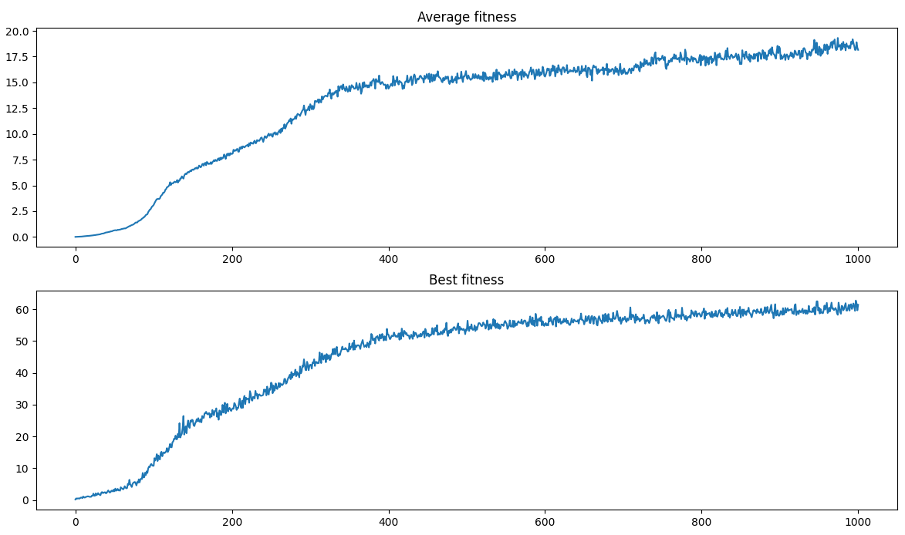
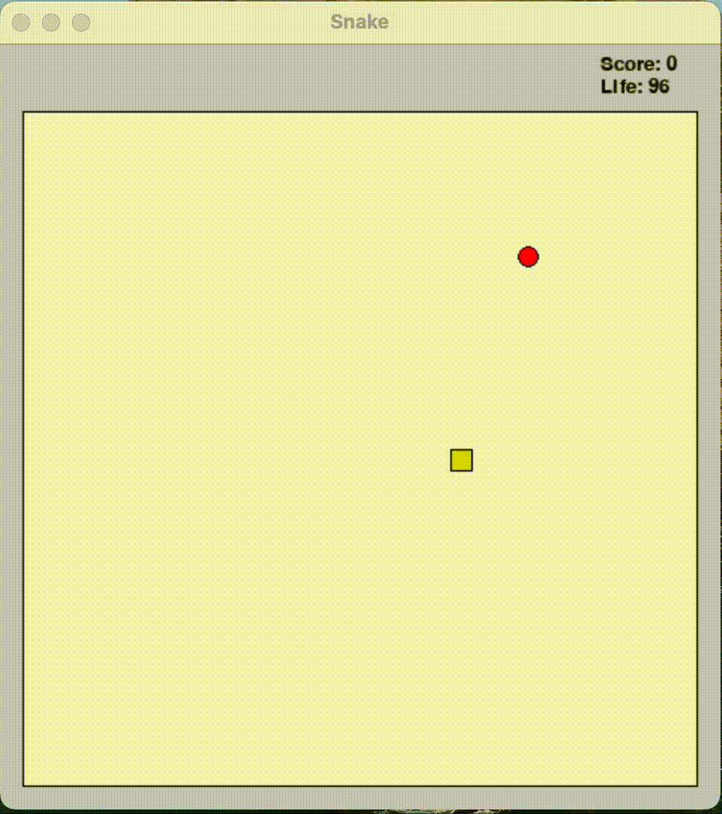
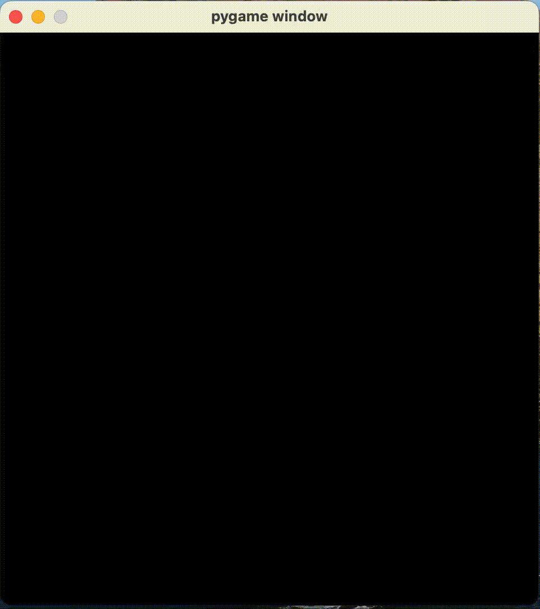
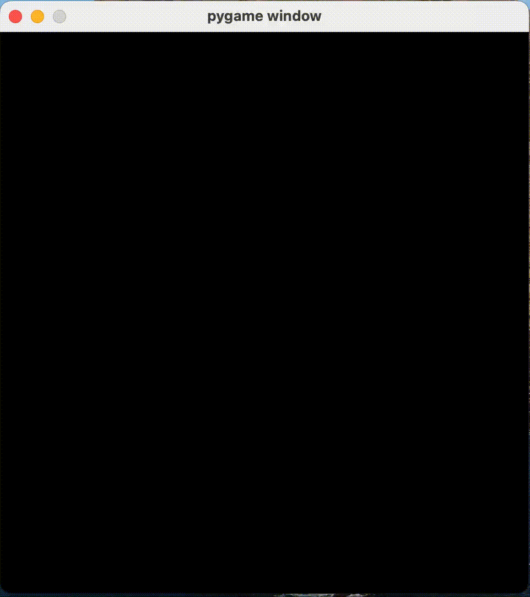
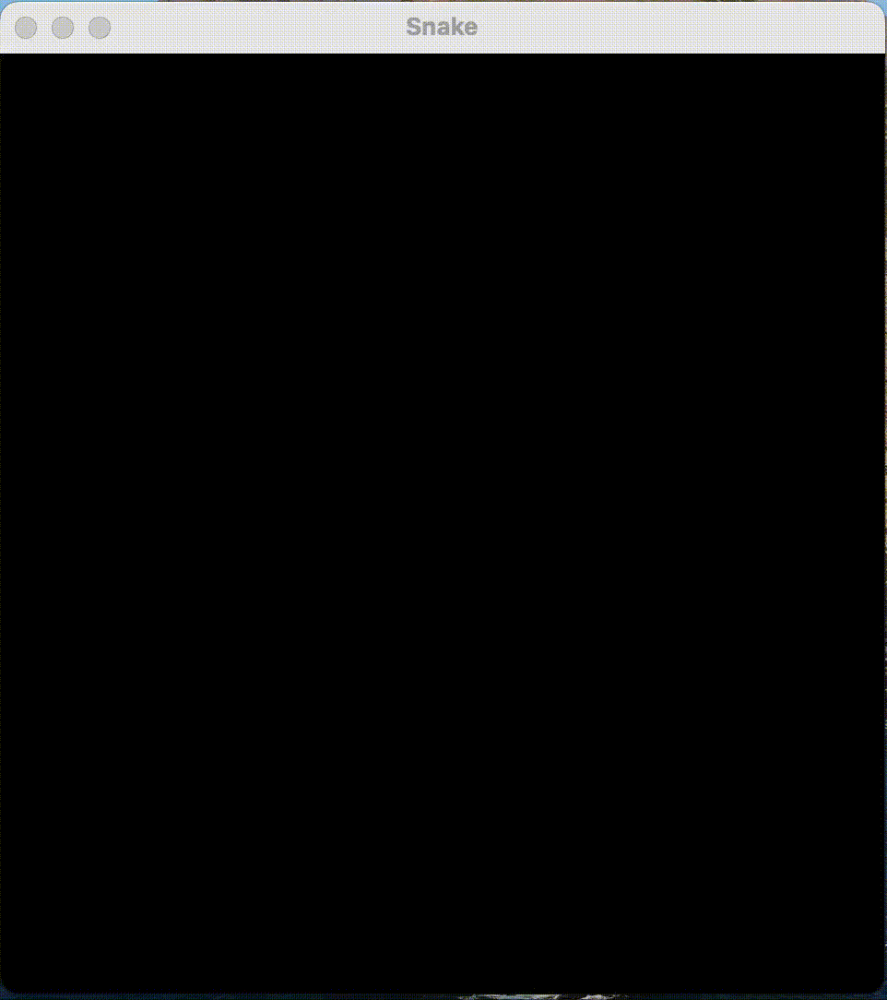

# Snake played by a Neural Network

This Python module implements a simple Snake game that can be played by a user (with the keyboard arrow keys) as well as by the computer itself using a Neural Network trained with a Genetic Algorithm.

A different version of the Neural Network can be also trained from scratch or from an existing pre-trained version. To speed up computations, training is performed in parallel using all but one of the available CPU cores.

## Table of Contents

1. [Usage](#usage)
2. [The Model](#the-model)
3. [Results](#results)

## Usage

This game is written in Python3. In order to play it (or to watch the computer play it) Python3 needs to be installed first. The game is tested with Python version 3.8 and higher. Earlier version have not been tested and may not work.

After Python is installed, the correct modules need to be installed as well. To do so, simply run  the following command from inside the SnakeML directory:
```
pip install -r requirements.txt
```

### Play Snake

Once Python3 and all the requirements are installed as per the above instructions, Snake can be played by simply typing in the terminal (from inside the SnakeML directory):
```
python3 snake.py
```

To watch the computer play it, add the `--ml` flag like this:
```
python3 snake.py --ml
```


### Train the Neural Network from scratch

In order to train a different version of the Neural Network, the TRAIN.SH script can be used on MacOS and Linux to specify all training options. Training runs in parallel using all but one of the available CPU cores to speed up the computations.

You first need to change the script permissions and make it executable by typing `chmod +x TRAIN.SH`.
You can then run the script like and specify the training options like this:
```
./TRAIN.SH -s 1000 -e 100 -m 3 -g 50 -l "9 9 9" -i 1 &
```

This will run on the background (because of the trailing `&`), and once finished will save the model in the `saved_models` subdirectory. Additionally, training information will be logged to a file in the `output` subdirectory during training.

The `TRAIN.SH` command line options are as follows:
```
  -s POP_SIZE
    Population size at each epoch
  -e EPOCHS
    Number of epochs for training
  -m MATCHES
    Number of matches played by each individual to calculate fitness
  -g LIFE_GAIN
    Snake life gain whenever an apple is eaten
  -l LAYERS_SIZE ...
    Number of neurons in each of the neural network layers, excluding the output layer (which has 3 neurons by design). 
    Input layer must have 9 neurons in the current configuration.
  -i INITIAL_LENGTH ...
    Initial snake length, can be an integer or a list of values in which case each individual will play MATCHES different matches starting with each initial length value.
```

## The Model

### Neural Network Architecture

The model that drives the computer's decisions when playing Snake is a Feed-Forward Neural Network with a flexible number of hidden layers and neurons. 
The activation functions are *relu* for the hidden layers and *softmax* for the output layer. 
Strictly speaking, softmax activation for the output layer is not necessary (a linear activation - i.e. no activation - would work exactly the same way), however this has the benefit of normalizing the output values that can be interpreted as the degree of certainty that the computer has on its decisions.

For the output layer architecture, my choice was to use 3 neurons, which correspond to "turn left", "continue straight" or "turn right" respectively. 
An alternative would have been to use 4 neurons, corresponding to the 4 keyboard arrows (with one of the four choices - the one in the opposite direction to the snake - unavailable at any time). 
The decision to use the architecture with 3 neurons was guided by the intuition that it doesn't matter the direction in which the snake is moving, but all that matters is the decision to turn left, right or continue straight relative to its current direction.

The choice of input layer is more complicated, as many different features can be calculated and used in the input layer. 
In general terms, I have maintained the approach to model distance not in absolute terms (up / down / right / left) but instead relative to the snake direction (in front of it / behind it / to its right / to its left). 
This is consistent with the approach used in the output layer and with the already mentioned intuition that all that matters is the position of objects relative to the snake direction.
After some analysis, I defined the input layer as follows (9 features in total - note that all values are normalised in the range [-1, 1]):
  * Relative distance to the apple (two values: distance parallel to the snake direction and distance orthogonal to the snake direction)
  * Relative distance to obstacles (three values: distance ahead, distance right and distance left)
  * "Regions Density". Density is defined as the number of free positions in a certain region. This feature is made by 4 values, corresponding to the density in the following 4x4 regions relative to the snake head: ahead and right, back and right, back and left, ahead and left.

Initially I had also considered including the snake length as an additional feature in the input layer, but seeing that it didn't improve the results I decided to remove it.

The number and size of hidden layers can be set by the user when training a new model. 
In the saved model that can be run as explained in [Usage](#usage), I used 4 hidden layers with 9 neurons each. 
This decision was driven by a grid search in which I tried several configurations and picked the one that yielded the best results.

### *(mu + lambda)-ES*

Usually, neural networks are trained with gradient descent by defining a loss function and calculating its gradient relative to each parameter. 
However, in some cases calculating the gradient of the loss is not possible. 
In case you're wondering, this is the scenario in which we are in: how would you define the loss in a Snake game, and most importantly how would you calculate the gradient of the loss with respect to the neural network weights?

An alternative to gradient descent is to use a Genetic Algorithm. 
A Genetic Algorithm is a machine learning optimization algorithm that, broadly speaking, tries to learn the optimal parameters of a function by randomly changing their values, and selecting the ones that perform better. 
When a loss function and its gradient are not available, using a Genetic Algorithm to optimize the parameters of a model can be very effective.

The genetic algorithm I used to optimize the neural network parameters is an Evolution Strategy known as *(mu + lambda)-ES*. 
The algorithm works as follows:
   1. An initial population of neural network parameters of size *mu + lambda* is randomly generated.
   2. The *fitness* of each individual is calculated. *Fitness* here is a value that depends on the task at hand and that measures how good an individual is at performing said task.
   3. *mu* individuals with the highest fitness are selected as parents.
   4. *lambda* offsprings are generated from the parents by applying a random mutation.
       - The mutation is a white noise added to the parameters, distributed as a Gaussian distribution with mean 0 and standard deviation that depends on each individual.
       - The standard deviation is also a parameter subject to a mutation itself, which in this case is a log-normal variable that multiplies the mutation standard deviation.
   5. The new population is formed by the union of the parents and the offsprings.
   6. Return to 2 until convergence or until the required number of epochs have passed.

Given the task at hand (play Snake), I have defined fitness as the average score (i.e. number of apples eaten) obtained by playing a given number of Snake matches. 
The number of matches to play to calculate an individual fitness represents a trade-off between training speed (the lower the number of matches the lesser it takes) and convergence to the global optimum (as the apple repositions randomly at the beginning of the match and every time it is eaten, the score that an individual gets on a single match may be determined just by sheer luck. The more matches are played, the more this randomness averages out).

# Results

Running `python3 snake.py --ml` lets the computer play Snake using the neural network parameters saved in `data/epoch1000.pickle`, with a neural network architecture that, in addition to the input layer with 9 neurons and the output layer with 3 neurons, uses 4 hidden layers with 9 neurons each.

The parameters have been trained by specifying the following options:
  * Population size (*mu + lambda*): 2000
  * Number of epochs: 1000
    * As shown below, the model continues to improve even after 1000 epochs. Therefore, training for more epochs would likely improve the results even further. 
  * Number of matches: 3
    * this was in my analysis the sweet spot in the training speed / convergence trade-off explained above
  * Initial snake length: "1, 5, 10, 15"
    * This means that for each individual, fitness was calculated by playing 3 matches with initial snake length of 1, 3 matches with initial length of 5, and so on.
    * The reason why I included this option for training is that in earlier epochs the snake barely learns how to avoid the borders, and usually only manages to eat a few apples, if any. This means that it would take many epochs for the snake to grow considerably in length, which means that in earlier epochs it would never learn to avoid its tail. Forcing it to start a match with a length greater than 1 helps the snake learning how to avoid hitting the tail right from the beginning of training.

It is worth mentioning that as a modification of the *(mu + lambda)-ES* algorithm, I set a minimum threshold for *sigma*, i.e. the standard deviation of the random mutation, equal to 0.1. 
This decision was driven by the observation that without this threshold sigma tended to converge towards 0 too quickly, resulting in the optimization being too slow.

#### Fitness Evolution



In the picture above, the average fitness (across the entire population) and the best fitness in the population for each epoch are shown. 
The graph shows that, although learning slows down after c.400 epochs, the model still continues to improve even after 1,000 epochs. 
At the end of the training period, the average individual is able to eat close to 20 apples, while the best performing one achieves around 60!

Let's now see the model in action at different stages of the training process!

#### Epoch 0


At the beginning of the training process, the snake is not able to eat any apple: it just continues straight until it hits the wall!

#### Epoch 10


After just 10 epochs, the snake has learnt not to hit the walls. 
However, learning how to actually eat the apple is another matter...

#### Epoch 100


After 100 epochs the snake has finally learnt to eat the apple, although with some mistakes along the way, and a nasty crash into the wall after a score of just 6 apples.

#### Epoch 400 (snippets only)


After 400 epochs the snake is able to make some great moves and definitely knows how to avoid the wall and its tail. 
Interestingly, it seems that it prefers to turn left even when turning right would have been the obvious and better choice (note this feature appeared in epoch 100 already).
Eventually it crashes into its tail with a score of 58: more than expected given the fitness evolution graph above!

#### Epoch 1000 (snippets only)


After 1,000 epochs the snake doesn't look much smarter than it was after 400 epochs, however we know from the graph above that actually on average (i.e. if compared on multiple games) it should score better than its earlier version. 
One issue it still maintains is that it still prefers to turn left, even when turning right would be a better option.